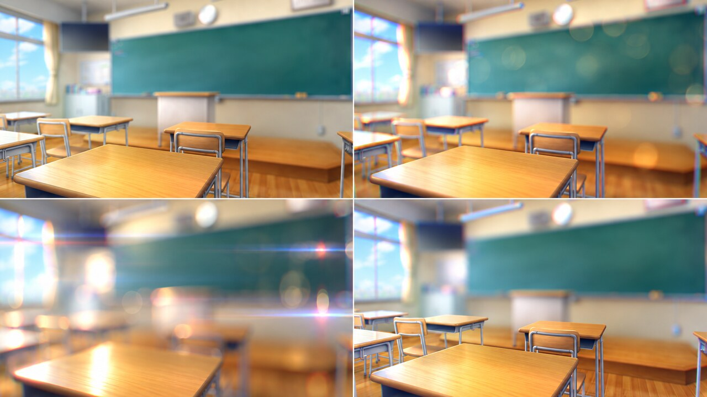

# Sa_coolblur

AEで使っていた自作プラグインを移植したものです。
YMM4用の色分散レンズブラー。ぼかしの広がりを3つの色に分け、玉ボケや色のにじみを作ります。

帯状・円形・深度マップ画像・全体の4モード。分散色、ボケの縁、ハイライト、縦横比、ピント位置を調整できます。

## インストール

[Actions](https://github.com/sabiasagimp4-ai/Sa_coolblur/actions) の成功した実行から `SaCoolBlurYmm` をダウンロードし、展開したフォルダを YMM4 の `user/plugin` に置いて再起動してください。映像エフェクトの「ぼかし」→「Sa_coolblur」で追加できます。

## パラメータ例

元画像を16:9に整え、同じ構図でパラメータを変えた見た目の参考例です。左上から順に、帯状フォーカス、円形フォーカス＋色分散、全体ぼかし＋アナモルフィック、反転フォーカスを想定しています。

実際の見た目は、半径・分散量・ボケの縁・縦横比・ハイライトブースト・ピント位置によって変化します。

## 補足

- 深度マップはPNGなどの静止画を指定します。AEの別レイヤー・動画参照には未対応です。未指定ならぼかしません。
- マップ画像は素材全体に合わせて伸縮します。ピントマップ表示では白い部分ほど強くぼけます。
- ピント幅は帯状では帯の全幅、円形では半径です。中心は素材に対する割合です。
- 大きい半径で粒が見える場合は画質を上げてください。高品質は処理が重くなります。
- 深度マップを上書きしたときは、ファイルを選び直すかプロジェクトを開き直してください。

[移植元](https://github.com/sabiasagimp4-ai/cool_blur) ／ [移植範囲と検証](docs/PORT.md)
