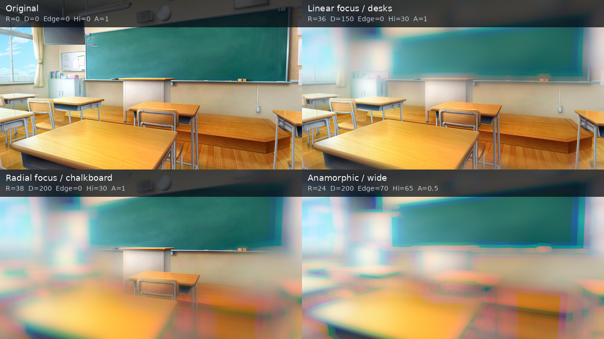

# Sa_coolblur

YMM4用の色分散レンズブラー。ぼかしの広がりを3つの色に分け、玉ボケや色のにじみを作ります。

帯状・円形・深度マップ画像・全体の4モード。分散色、ボケの縁、ハイライト、縦横比、ピント位置を調整できます。

## Webで試す

[Sa_coolblur Web Test](https://sabiasagimp4-ai.github.io/Sa_coolblur/) では、下の写真や手元の画像を使って各パラメータをブラウザ上で試せます。既定は軽い50%表示です。元のピクセル半径で確認するときは「プレビュー解像度」を100%にしてください。

## インストール

[最新版の`.ymme`をダウンロード](https://github.com/sabiasagimp4-ai/Sa_coolblur/releases/latest/download/SaCoolBlurYmm.ymme)してダブルクリックし、YMM4のインストーラーから導入してください。手動で入れる場合は[ZIP版](https://github.com/sabiasagimp4-ai/Sa_coolblur/releases/latest/download/SaCoolBlurYmm.zip)を展開して`SaCoolBlurYmm`フォルダをYMM4の`user/plugin`に置き、再起動してください。映像エフェクトの「ぼかし」→「Sa_coolblur」で追加できます。

## パラメータ例

添付画像を中央クロップし、896×504の正確な16:9にした入力を使っています。比較画像はAI生成ではなく、元プラグインGPU版の計算順（前処理、ハイブリッドVogel点群、色分散、ボケ縁、線形ライト、Auto時の縮小→拡大合成）をCPU参照コードで再現したものです。画質は元プラグインの既定値「標準（256）」です。AE／YMM4の実アプリ画面キャプチャではないため、画素完全一致の証拠としては扱いません。

左上は原画、右上は帯状フォーカス、左下は円形フォーカス＋色分散、右下はアナモルフィックぼかしです。各パネルに実際に使った半径（R）、分散量（D）、ボケの縁（Edge）、ハイライト（Hi）、縦横比（A）を表示しています。

再生成用コードは [tools/render_examples.py](tools/render_examples.py) と [tools/render_reference.cpp](tools/render_reference.cpp)、全設定値は [parameters.json](assets/examples/parameters.json) にあります。

## 元プラグインとの一致

- 既定の「ダウンサンプル: 自動」は元AE GPU版と同じ選択です。半径32px以上で2倍、96px以上で4倍に縮小してぼかし、線形補間で戻してフル解像度の焦点量で原画と合成します。「なし（原寸）」なら通常解像度パスです。
- 小半径の整数ディスク、64/128/256/512点のVogel切替、色チャンネルの重み、リニアライト、ハイライト、アルファ処理は元GPU版と同じ順で計算します。AE CPU版のFFT経路は対象外です。
- CUDAとD3D11では浮動小数点・テクスチャ補間の実装が異なるため、別GPU間の8bit出力を全画素バイト単位で保証することはできません。差を確認する場合は、元側もGPU処理ON・同じ画質・同じダウンサンプル設定で比較してください。

## 補足

- 深度マップはPNGなどの静止画を指定します。AEの別レイヤー・動画参照には未対応です。未指定ならぼかしません。
- マップ画像は素材全体に合わせて伸縮します。ピントマップ表示では白い部分ほど強くぼけます。
- ピント幅は帯状では帯の全幅、円形では半径です。中心は素材に対する割合です。
- 大きい半径で粒が見える場合は画質を上げてください。高品質は処理が重くなります。
- 深度マップを上書きしたときは、ファイルを選び直すかプロジェクトを開き直してください。

[移植元](https://github.com/sabiasagimp4-ai/cool_blur) ／ [移植範囲と検証](docs/PORT.md)
