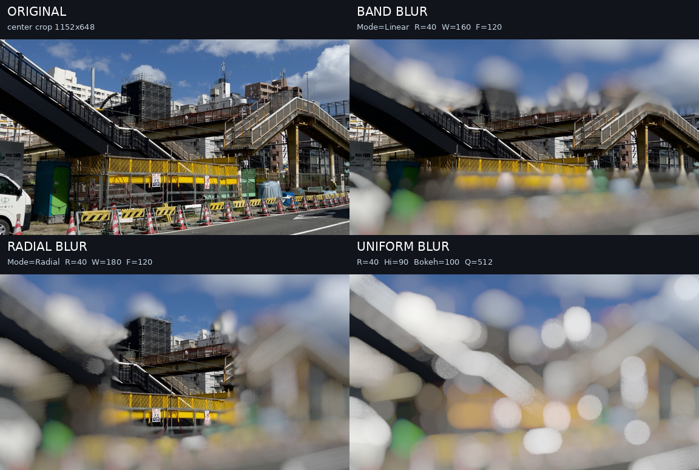
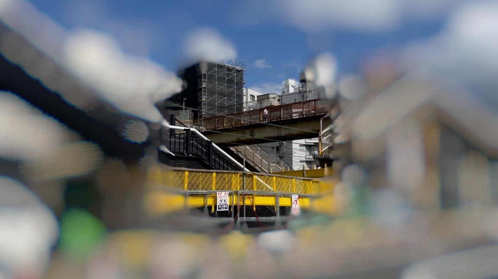

# Sa_coolblur

YMM4用の色分散レンズブラーです。帯状・円形・深度マップ・全体の4モードに対応し、分散量、ボケの縁、ハイライト、玉ボケ強調、縦横比、ピント位置を調整できます。

## ダウンロード

[最新版の`.ymme`をダウンロード](https://github.com/sabiasagimp4-ai/Sa_coolblur/releases/latest/download/SaCoolBlurYmm.ymme)して、YMM4のインストーラーから導入してください。

## Webで試す

[Sa_coolblur Web Test](https://sabiasagimp4-ai.github.io/Sa_coolblur/)

## 見本

添付写真を16:9（1152×648）に中央クロップし、元プラグインの計算を再現した参照レンダラーで処理しています。画像生成は使用していません。

| モード | 設定 |
| --- | --- |
| 帯ぼけ | 半径40px / ピント幅160px / 境界ぼかし120px |
| 円ぼけ | 半径40px / ピント幅180px / 境界ぼかし120px |
| 全体ぼけ | 半径40px / ハイライト90% / 玉ボケ強調100% / 高品質512 |

ボケ部分だけに色収差を加えた例です。円形モード、分散量±30%（UI値30）で、中央のピント部分は原画を保っています。

「玉ボケ強調」は明るい部分を滑らかな円形ボケとして持ち上げます。0%では従来の計算を維持し、50〜100%が目安です。
